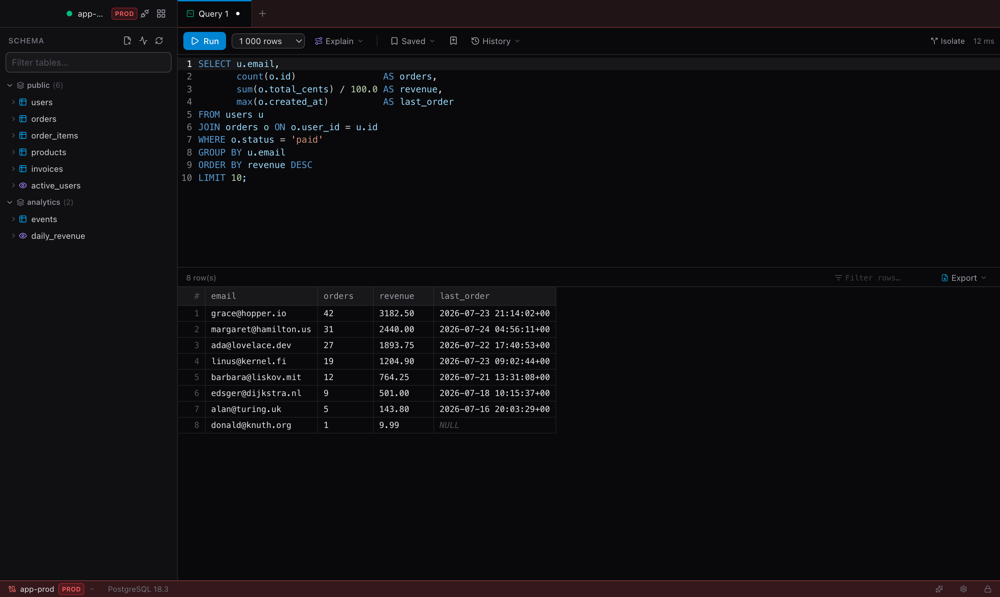
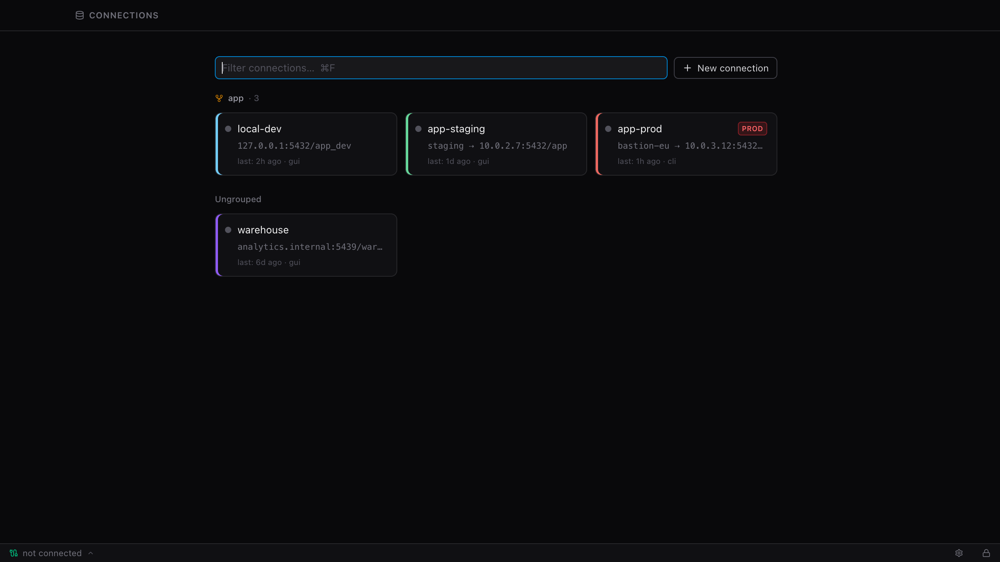
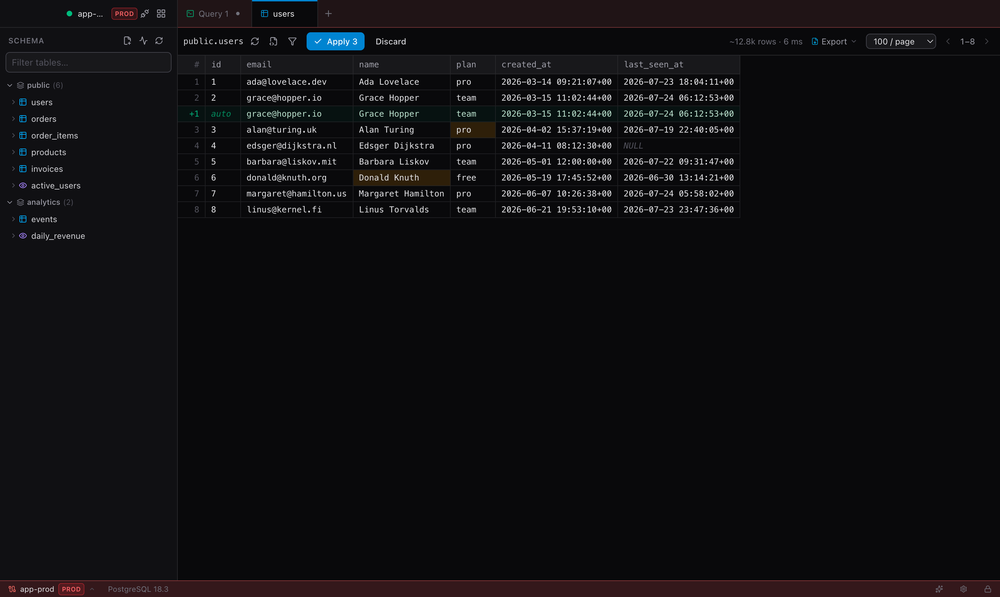

# sql-kai

Десктопный Postgres-клиент (Tauri 2 + React 19) с нативной поддержкой SSH-туннелей
и CLI `sql-kai` поверх того же ядра (внутри бандла — sidecar `sql-kai-cli`).



<p align="center">
  
  
</p>

## Установка (macOS, Apple Silicon)

### Homebrew

```bash
brew install kaidstor/tap/sql-kai
```

Каск ставит приложение и CLI `sql-kai` в PATH.

### Вручную (.dmg)

Скачайте `.dmg` из [последнего релиза](https://github.com/Kaidstor/sql-kai/releases/latest) и перетащите sql-kai в Applications.

Приложение подписано Developer ID и нотаризовано Apple (с v1.20.1) — Gatekeeper
не блокирует запуск, но при первом открытии macOS один раз спросит подтверждение
(«приложение скачано из интернета»): нажмите Open. Дальше оно обновляется само —
кнопка в статус-баре.

Сборки **до v1.20.1** подписаны сертификатом Apple Development и не нотаризованы —
Gatekeeper блокирует их наглухо («приложение повреждено»). Если ставите такую
версию, снимите карантин: `xattr -dr com.apple.quarantine /Applications/sql-kai.app`
(или System Settings → Privacy & Security → Open Anyway).

Апдейт на v1.20.1 меняет сертификат подписи, а вместе с ним — code signature
приложения и CLI. ACL уже созданных keychain-элементов vault'а выданы старой
подписи, поэтому после обновления macOS один раз спросит пароль от связки ключей:
перевключите Touch ID на экране unlock и выполните `sql-kai vault trust`, чтобы
вернуть тихий доступ.

CLI `sql-kai` лежит внутри бандла — чтобы он был в PATH и обновлялся вместе с приложением:

```bash
ln -sf /Applications/sql-kai.app/Contents/MacOS/sql-kai-cli ~/.local/bin/sql-kai   # любая папка из PATH
```

### Скилл для AI-агентов

В репозитории есть скилл `sql-kai` ([skills/sql-kai/SKILL.md](skills/sql-kai/SKILL.md)) по спецификации [Agent Skills](https://agentskills.io) — инструкции агенту, как выполнять SQL через CLI. Установка (CLI сам спросит, в какого агента и куда — в проект или глобально):

```bash
npx skills add https://github.com/Kaidstor/sql-kai --skill sql-kai
```

## Стек

- **Backend**: Rust, `tokio-postgres` (simple-query протокол — сервер сам форматирует значения в текст, любые типы отображаются без маппинга), собственный vault (`aes-gcm` + `argon2` — секреты шифруются мастер-паролем), SSH-туннели через супервизию системного `ssh -N -L`.
- **Frontend**: React 19, Vite 8, Tailwind CSS v4, zustand, TanStack Table, CodeMirror 6 (`@codemirror/lang-sql`).

## Соглашения кода

Чтобы одинаковые вещи назывались одинаково в обоих доменах (Table / Structure) и
на обеих сторонах IPC:

- **Файлы `src/components/`**: `PascalCase.tsx` — файл-компонент (один экспорт,
  имя файла = имя компонента); `lowercase.tsx|ts` — модуль-набор мелких экспортов
  (`ui.tsx`, `grid/menus.tsx`, `grid/copyActions.ts`, `structure/shared.tsx`) и
  хуки (`useGridSelection.ts`).
- **Импорт стора** — всегда из барреля `lib/store`, не из `lib/store/types` и не
  из `lib/store/slices/*`.
- **Глаголы получения данных**: `refresh*` — принудительный перезапрос
  (`refreshTables`, `refreshTablePage`, `refreshProfiles`), `load*` — «взять, если
  ещё не в кэше» (`loadTableColumns`, `loadSchemaEnums`), `get*` — тонкая обёртка
  над одной IPC-командой в `lib/api.ts`.
- **Стейджинг правок**: `stage*` — поставить правку в очередь, `unstage*` — снять
  (`unstageInsertRow`, `unstageColumnAdd`), `set<Что><Состояние>(…, value)` —
  идемпотентная пометка (`setRowsDeleted`, `setColumnDropped`), `applyXEdits` /
  `discardXEdits` — применить транзакцией / сбросить (домен в имени: `applyTableEdits`,
  `applyStructureEdits`).
- **Флаги**: `loading` — загрузка данных вкладки (в сторе), `running` — исполняется
  запрос, `busy` — локальный `useState` вокруг одного действия; видимость панелей —
  `*Open` (`sidebarOpen`, `filterOpen`).
- **Типы** (`lib/types.ts`): `*Config` — блок настроек соединения, `*Settings` —
  настройки приложения, `*Info` — запись каталога БД, `*Result` — ответ команды
  бэкенда, `*Status` — состояние.
- **Env-переменные** — префикс `SQL_KAI_*` (см. `src-tauri/src/bin/sql-kai-cli/envvar.rs`).
- **Язык user-facing строк** — по адресату, а не по крейту: всё, что может дойти до
  GUI (ошибки `src-tauri/src/**` вне `bin/`, тосты фронтенда и **весь** diagnostics-лог
  `logging::log`, включая холдерский — его показывает LogViewer), пишем по-английски;
  вывод, который читает только пользователь CLI (`bin/sql-kai-cli/**` и текст ошибок
  broker-протокола, который рендерит CLI-клиент), — по-русски.
- **Rust, запись на диск** (`store.rs`): `save_*` — переписать коллекцию целиком,
  `upsert_*` — вставить/обновить элемент (ошибка важна), `record_*` — дописать
  событие best-effort.

## Возможности

- Профили подключений: сохраняются в `~/Library/Application Support/sql-kai/profiles.json` (файл 0600, только несекретные поля). Пароли БД и SSH-passphrase шифруются в `vault.json`: один случайный ключ (DEK) шифрует все секреты одним AES-256-GCM блобом, сам DEK обёрнут ключом из мастер-пароля (Argon2id). При старте vault разблокируется один раз на всю сессию — никаких per-connection промптов ОС. Все конфиг-файлы пишутся атомарно (tmp+fsync+rename), DEK зачищается из памяти при блокировке.
- Touch ID (macOS): опциональный быстрый путь — приложение проверяет биометрию через `LocalAuthentication` (LAContext, системный fallback — пароль аккаунта) и затем читает копию DEK из login keychain. Никаких entitlements/провижининг-профилей/платного Apple-аккаунта не требуется, работает и в `tauri dev`. Мастер-пароль всегда остаётся app-fallback'ом. Включается чекбоксом на экране setup/unlock. Release-сборка подписывается Developer ID (`bundle.macOS.signingIdentity`, hardened runtime) — стабильная подпись избавляет от повторных keychain-промптов между сборками. Смена самого сертификата (как в v1.20.1: Apple Development → Developer ID) меняет designated requirement, и ACL созданных ранее keychain-элементов перестают ему соответствовать — после такого релиза Touch ID и `sql-kai vault trust` нужно включить заново.
- SSH-туннель на профиль: указываешь SSH-хост (работают alias из `~/.ssh/config`, включая ProxyJump), приложение само подбирает свободный локальный порт, поднимает `ssh -N -L`, следит за процессом и убивает его при дисконнекте/выходе.
- SQL-редактор с подсветкой Postgres-диалекта, ⌘⏎ — выполнить, поддержка нескольких стейтментов через `;`, отмена длинного запроса (pg cancel protocol).
- Браузер схемы: схемы → таблицы/вьюхи, фильтр по имени.
- Табличный просмотр: пагинация, сортировка кликом по колонке, приблизительный счётчик строк (`reltuples`, без `count(*)` по большим таблицам).
- Лимит строк на выборку (100 … 50 000), индикатор обрезки.
- Выделение строк в гриде: клик — одна, ⌘/Ctrl+клик — точечно, Shift+клик — диапазон. ПКМ — контекстное меню (Base UI): копировать ячейку / строки через пробел (⌘C) / TSV / JSON / всё с заголовком.
- Кастомная шапка окна: нативный titlebar скрыт (`titleBarStyle: Overlay`), traffic lights поверх приложения, окно таскается за верхнюю полосу (сайдбар + таббар).
- Живёт в menu bar (macOS): закрытие окна (красная кнопка / Close Window) прячет его и убирает иконку из Dock и Cmd-Tab (activation policy → Accessory), а приложение — вместе с сессиями, туннелями и брокером для `sql-kai` — остаётся в трее. Вернуть окно: клик по иконке в трее или повторный запуск из Finder/Spotlight (policy возвращается в Regular). Полный выход — ⌘Q / Quit (в меню приложения или трея).

## SSH: как это работает

Туннель — это дочерний процесс `ssh -N -o BatchMode=yes -o ExitOnForwardFailure=yes -L 127.0.0.1:<free>:<db_host>:<db_port> <target>`.

- Аутентификация: ключи / ssh-agent / `~/.ssh/config`. Пароль по SSH не поддерживается (BatchMode) — GUI не может отвечать на интерактивные промпты.
- `Host`/`Port` в секции Database — адрес БД **с точки зрения SSH-сервера** (обычно `localhost:5432`).
- `ServerAliveInterval=15` — мёртвый туннель обнаруживается за ~45 секунд; при потере соединения клиент попросит переподключиться.

## CLI `sql-kai`

Консольный клиент поверх того же Rust-ядра (отдельный бинарь, cargo-фича `cli`):
профили, ssh-туннели, vault и история запросов общие с GUI. Подробная
документация — [docs/sql-kai.html](docs/sql-kai.html).

```bash
sql-kai init                        # первичная настройка: PATH, vault trust, MCP, автодополнение
sql-kai completion zsh|bash|fish    # скрипт автодополнения (дополняет и имена профилей)
sql-kai <alias> -c "SELECT ..."     # SQL по профилю; вывод table/--json/--csv/-t
sql-kai discover <ssh-alias>        # ssh → найти postgres в docker → создать профиль
sql-kai import [--file f.json]      # массовый импорт профилей из JSON (пароли → vault)
sql-kai exec <ssh-alias> -c "..."   # fallback без профиля: ssh + docker exec psql
sql-kai schema <alias> [--json]     # вся схема одним дампом: таблицы, вьюхи, enum, функции
sql-kai logs <alias> [-f] [-n 200]  # журнал postgres профиля: ssh → docker logs
sql-kai fork <alias> [новое-имя]    # копия базы в локальном docker + профиль на неё
sql-kai mcp [<alias>]               # MCP-сервер для агентов (см. ниже)
sql-kai mcp install [клиент]        # прописать его в конфиг агента (mcp status — где уже)
sql-kai tables|columns|ddl|indexes <alias> [schema.]table
sql-kai rotate <alias> --from-sec   # ротация пароля роли через sec + ALTER ROLE
sql-kai doctor                      # сохранённые пароли ещё аутентифицируются?
sql-kai doctor --install-info       # чем поставлен CLI и чем его обновлять
sql-kai feedback "…"                # ссылка на issue с диагностикой (не отправляет сам)
sql-kai tunnel list|close [--all]   # персистентные ssh-туннели (ControlMaster)
sql-kai vault trust                 # тихий доступ CLI к паролям vault (keychain)
sql-kai sessions                    # живые сессии GUI-брокера и holder'а
sql-kai holder stop                 # погасить фоновый держатель сессий
```

Ключевое:

- **Сессия по умолчанию read-only** (`SET default_transaction_read_only = on`);
  запись и DDL — только с явным `--write`.
- **Запись в production-профиль — с отдельным разрешением**: одного `--write` мало.
  Разрешает человек — вводом имени профиля в терминале, флагом `--prod-write` или
  `SQL_KAI_ALLOW_PROD_WRITE=<профиль>` (список через запятую либо `1` — все prod-профили).
  Без TTY (MCP, CI, пайп) остаётся только env, поэтому по умолчанию агент в прод не пишет.
  Барьер общий для `q`, `saved run`, `rotate`, MCP-tool `query` и `exec` на ssh-хост
  prod-профиля; чтение ничего не спрашивает.
- **`sql-kai schema <alias>`** — вся структура базы за один поход в каталог
  (таблицы, вьюхи, матвьюхи с колонками, констрейнтами, индексами, триггерами,
  плюс enum-типы и функции) вместо обхода `tables` → `columns`/`ddl`/`indexes`
  по каждой таблице. Ради этого команда и появилась: у агента один вызов вместо
  десятков и один согласованный снимок. `--json`, `--schema`, `--definitions`,
  `--comments`, `--internal`.
- **`sql-kai fork <alias>`** — копия базы профиля в локальном docker (`pg_dump`
  из read-only-сессии → `postgres:<мажор источника>`) плюс профиль на неё:
  миграцию прогоняют там, а не на проде. По умолчанию только схема, `--data` —
  с данными. Метку `production` форк не наследует.
- **`sql-kai logs <alias>`** — журнал сервера (ssh → `docker logs`), работает и
  когда postgres уже не принимает соединения: `-f`, `--since 10m`, `| grep`.
- Мультистейтмент — одна неявная транзакция: ошибка в середине откатывает всё.
  Отсюда следствие: `CREATE INDEX CONCURRENTLY` — только отдельной командой.
- `sql-kai discover` сам находит postgres-контейнер на хосте (`docker ps` → env
  контейнера → published-порт или bridge-IP) и сохраняет профиль; пароль уходит
  в vault. Профиль сразу виден в GUI. Если контейнеров несколько — берётся
  первый с предупреждением; конкретный выбирается через
  `--container <имя> --name <профиль>` (флаг есть и у `sql-kai exec`).
- **Переиспользование ssh:** для профилей с туннелем CLI держит персистентный
  ssh-мастер (`ControlMaster` + `ControlPersist`) — первый запрос платит за
  аутентификацию, последующие цепляются к готовому мастеру без повторной
  авторизации (запросы за туннелем заметно быстрее). Включено по умолчанию;
  `--no-mux` отключает, `SQL_KAI_SSH_MUX_TTL` задаёт TTL, `sql-kai tunnel list|close`
  управляет мастерами. GUI не затронут.
- **Сессии между запусками (holder):** запущенный GUI обслуживает `sql-kai q`
  своей сессией через брокер; без GUI первый `sql-kai q` сам поднимает фоновый
  `sql-kai holder run` с тем же протоколом — pg-сессии и ssh-туннели живут между
  вызовами (повторные запросы не платят за connect), открытая транзакция
  доживает до следующего вызова. Holder разлочивает vault только тихо
  (trust / `SQL_KAI_VAULT_PASSWORD`, env-пароль после разлока вычищается из
  окружения), гаснет сам через ~2 мин без сессий; немедленно — `sql-kai holder
  stop`, vault lock в GUI или `sql-kai vault revoke`. Одиночный вызов мимо
  GUI/holder — `--local` (одноразовая сессия) или `--no-mux` (плюс свежий
  ssh без ControlMaster).
- **Интеграция с [sec](https://github.com/Kaidstor/sec)** (агент-безопасный менеджер секретов; хранилища не сливаются —
  vault для GUI, sec для CLI). sql-kai зовёт `sec` из PATH (или `SQL_KAI_SEC_BIN`), ключ
  по конвенции `<имя>/DB_PASSWORD`:
  - `sql-kai discover --to-sec [--no-vault]` — пароль БД в sec (прод-политика: не в vault),
    `sql-kai <alias> --from-sec` — брать пароль из sec на лету;
  - `sql-kai rotate <alias>` — ротация пароля роли: sec генерирует/версионирует (старое
    в историю sec = страховка от локаута), sql-kai применяет `ALTER ROLE` и проверяет;
  - `sql-kai doctor` — сохранённые пароли ещё аутентифицируются? (детект дрейфа vault↔sec↔БД);
  - история запросов маскирует литералы паролей при записи, `sql-kai history --scan` проверяет
    её через `sec scan`.
- Vault в CLI разлочивается по цепочке: keychain-trust (`sql-kai vault trust` —
  копия DEK в login keychain, чтение без промптов) → `SQL_KAI_VAULT_PASSWORD` →
  запрос в TTY; полный обход — `--password-env VAR`.
- Env-переменные — единый префикс `SQL_KAI_*`: `SQL_KAI_CONFIG_DIR` (конфиг-директория —
  изолированные окружения/тесты), `SQL_KAI_VAULT_PASSWORD` (мастер-пароль vault),
  `SQL_KAI_SSH_PASSPHRASE` (askpass для ssh-ключа), `SQL_KAI_SSH_MUX_TTL` (TTL ssh-мастера,
  сек; по умолч. 300), `SQL_KAI_SEC_BIN` (путь к `sec`),
  `SQL_KAI_ALLOW_PROD_WRITE` (разрешение на запись в prod-профили без вопросов).

Установка:

```bash
# из репозитория (фронтенд не нужен: CLI не тянет dist)
cargo install --path src-tauri --features cli --bin sql-kai-cli
# стабильная подпись — иначе keychain-trust слетает после каждой пересборки.
# В tauri.conf.json лежит Developer ID мейнтейнера; если его нет в связке ключей,
# подставьте свой сертификат. Ad-hoc (`--sign -`, без --timestamp) тоже работает,
# но такая подпись меняется при каждой сборке — `sql-kai vault trust` придётся повторять
codesign --force --options runtime --timestamp \
  --sign "$(jq -r '.bundle.macOS.signingIdentity' src-tauri/tauri.conf.json)" ~/.cargo/bin/sql-kai-cli

# готовый бинарь из GitHub-релиза (macOS arm64; собирает и грузит release.sh)
curl -fL https://github.com/Kaidstor/sql-kai/releases/latest/download/sql-kai-cli-darwin-aarch64.tar.gz \
  | tar xz -C /usr/local/bin
```

## MCP для AI-агентов

`sql-kai mcp` — MCP-сервер поверх stdio: агент (Claude Code, Codex, Cursor, …)
ходит в базы через тот же сервер сессий, что и CLI, — vault уже разблокирован,
ssh-туннели подняты, сессия read-only по умолчанию, запросы попадают в общую
историю. Подключается одной командой:

```bash
sql-kai mcp install                  # список клиентов и путей их конфигов
sql-kai mcp install claude-code      # прописать (claude-desktop, codex, cursor, vscode, windsurf, gemini)
sql-kai mcp install cursor --profile vuln   # закрепить сервер за одной базой
sql-kai mcp status                   # где sql-kai уже прописан
```

Запись мержится в конфиг клиента, не затирая чужие MCP-серверы; перед правкой
делается `.bak`, `--dry-run` показывает, что будет записано.

Tools: **`schema`** (вся структура базы за один вызов — основной инструмент
интроспекции), `query` (SQL с `$1..$N`-параметрами или .sql-файлом; чувствительные
колонки маскируются), `tables`/`columns`/`ddl`/`indexes`, `open_table`/`open_query`
(открыть таблицу или готовый запрос вкладкой в GUI) и `selection` (что пользователь
сейчас видит и выделил — для реплик вроде «эта строка»). У всех объявлены
`annotations` и `outputSchema`, ответ приходит и текстом, и структурой.

Два режима: **закреплённый** (`sql-kai mcp <alias>`) — девять tools по одной базе,
параметра `profile` нет вовсе, перепутать базы невозможно (эту форму запускает
панель агента в GUI); **мультипрофильный** (`sql-kai mcp`) — добавляется tool
`profiles`, у остальных появляется параметр `profile`, и одна запись в конфиге
обслуживает все базы сразу.

Запись в production через MCP по умолчанию не проходит: у сервера нет TTY,
спросить человека невозможно, поэтому `"write": true` для prod-профиля разрешает
только `SQL_KAI_ALLOW_PROD_WRITE` в окружении самого сервера — то есть в конфиге
MCP-клиента, куда модель не пишет. Подробности — в
[docs/sql-kai.html](docs/sql-kai.html#mcp).

## Запуск

```bash
pnpm install
pnpm tauri dev     # разработка
pnpm tauri build   # сборка .app/.dmg

# локальный релиз: бамп версии, сборка, подпись, нотаризация, GitHub-релиз
# (артефакты автообновления + sql-kai-cli-darwin-aarch64.tar.gz).
# APPLE_PASSWORD хранится в sec — без него tauri молча пропустит нотаризацию,
# и Gatekeeper заблокирует релиз у всех, кто его поставит
sec run sql-kai --only APPLE_PASSWORD -- ./release.sh
```

## Тесты

Интеграционный тест ядра (нужен Docker):

```bash
docker run -d --name sqltauri-test-pg -e POSTGRES_PASSWORD=testpw \
  -e POSTGRES_DB=demo -p 54329:5432 postgres:16-alpine
cd src-tauri && cargo test --test db_integration -- --ignored
```

## Roadmap / идеи

- TLS для прямых подключений (`rustls`), сейчас прямые коннекты — без TLS (через туннель это не критично).
- Общий ssh-туннель между GUI и CLI: сейчас CLI переиспользует свои коннекты через `ControlMaster`, но GUI держит отдельный туннель — их можно свести на один мастер.
- EXPLAIN-визуализация, экспорт CSV/JSON из грида.
